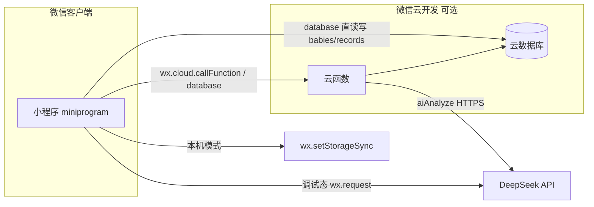
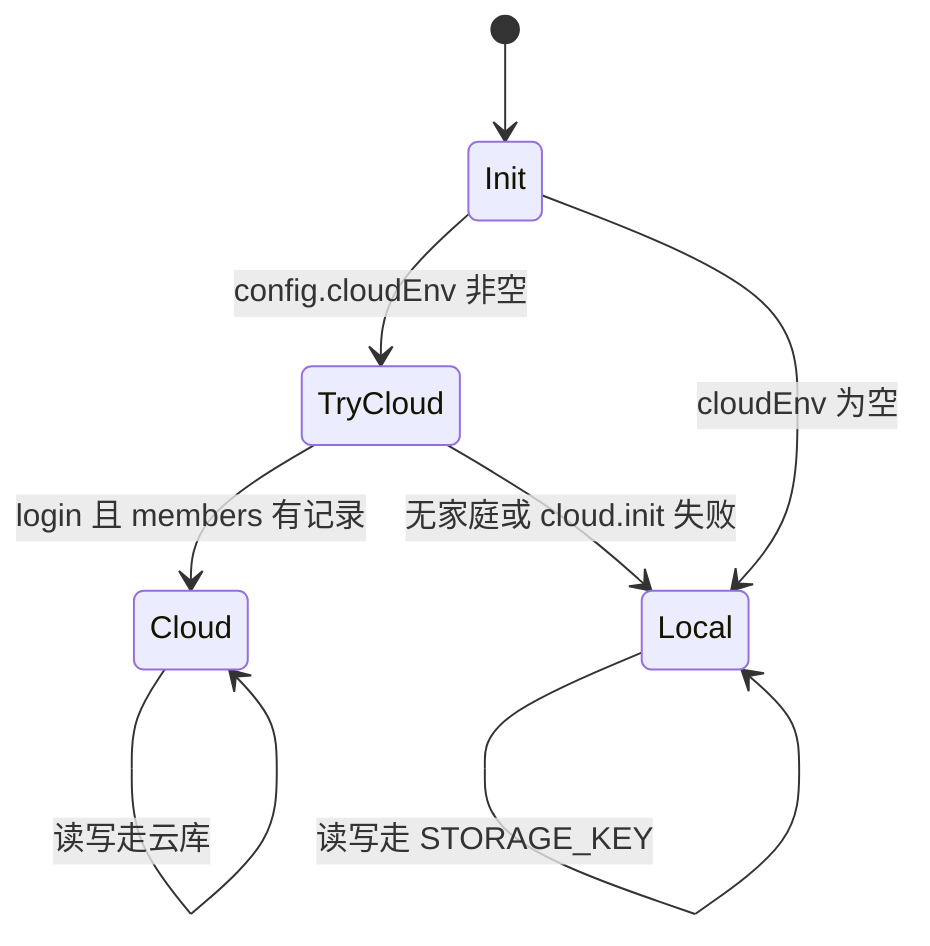
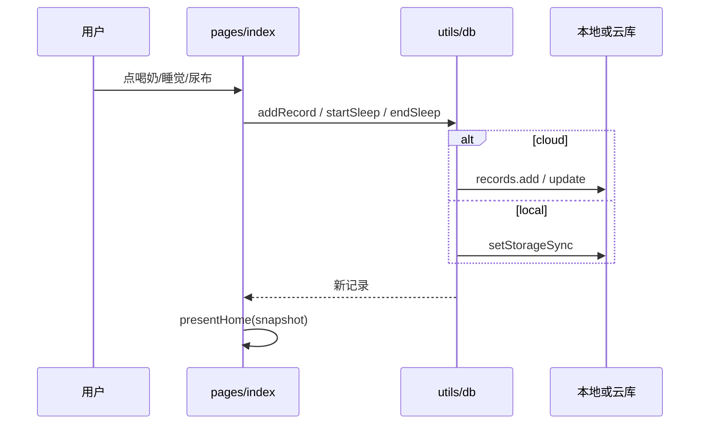
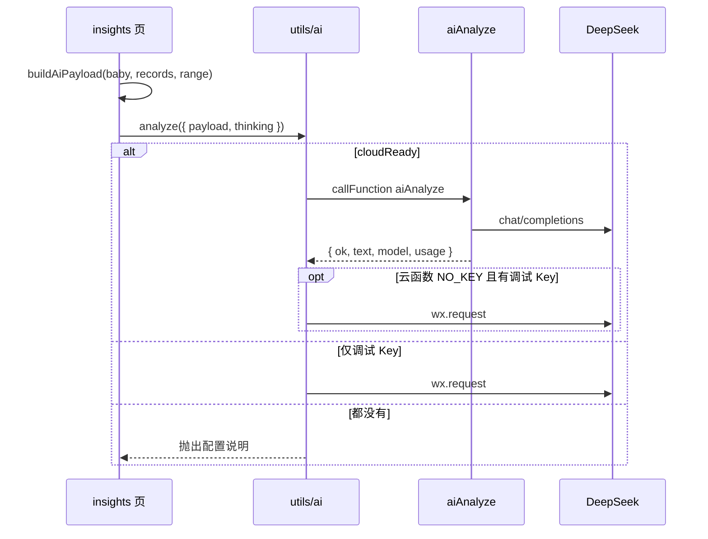

# 小芽记架构说明书

| 项 | 内容 |
| --- | --- |
| 系统 | 小芽记微信小程序 |
| 版本 | 1.0.0 |
| 日期 | 2026-08-31 |

---

## 1. 架构目标

1. **双模式运行**：无云开发时本机可用；有云开发时家庭多端共享。
2. **写入路径短**：页面只调数据层 `db`，不在各页复制存储细节。
3. **统计与展示分离**：`stats` / `format` / `insights` 纯函数，便于 Node 测试。
4. **AI 可降级**：云函数优先；失败或无密钥时可前端调试 Key，或复制提示词到网页。

## 2. 系统上下文



外部系统：

- **微信**：登录态、openid、云开发、小程序运行时。
- **DeepSeek**：`https://api.deepseek.com/chat/completions`。
- **无后端业务服务**：除云函数外没有自建 HTTP API。

## 3. 逻辑架构

```
miniprogram/
  app.js                 启动时 db.init()
  config.js              cloudEnv、DeepSeek 调试配置
  pages/                 页面：引导、记录、时间轴、生长、家庭、洞察、编辑
  custom-tab-bar/        记录 / 时间轴 / 生长 / 家庭
  components/record-item 单条记录展示
  utils/
    db.js                唯一数据门面（本地 + 云）
    constants.js         类型、常用量、时间偏移
    stats.js             聚合、标题、生长序列
    format.js            时间、月龄、跨区间重叠
    present.js           首页/时间轴 ViewModel
    insights.js          本周报告、AI payload
    ai.js                调用云函数或直连 DeepSeek
    ai-prompt.js         系统提示词（与云函数副本保持一致）
    id.js                uid、邀请码
```

云函数：

| 函数 | 职责 |
| --- | --- |
| `login` | 返回 openid / appid / unionid |
| `createFamily` | 原子创建家庭、创建者成员、第一个宝宝 |
| `joinFamily` | 按邀请码加入，拒绝无效码 |
| `aiAnalyze` | 校验密钥与 payload，调用 DeepSeek |

云数据库集合：`families`、`members`、`babies`、`records`（字段见 `database/README.md`）。

## 4. 运行模式



- `mode === 'cloud'`：家庭/成员/宝宝/记录以云为准；当前宝宝 ID 仍缓存在 `xiaoya_current_baby`。
- `mode === 'local'`：整份状态 JSON 存在 `xiaoya_db_v1`。
- `cloudReady`：云初始化成功，即使当前用户还没有家庭（用于之后 `createFamily` / `joinFamily`）。

页面通过 `db.onChange` 的替代方案：各页 `onShow` 调 `db.snapshot()` 再 `setData`。`db.persist()` 在本地写 storage，并通知 watcher。

## 5. 核心数据流

### 5.1 快记写入



### 5.2 建家

- 本地：内存生成 `fam_` / `baby_` id 与邀请码，写入 storage。
- 云：`createFamily` 在服务端 `add` 三个集合；客户端再 `_loadCloud()` 用云 `_id` 覆盖本地临时结构。

### 5.3 AI 分析



客户端与云函数共用同一套 `SYSTEM_PROMPT` / `userMessage` / `allowedModel`（`miniprogram/utils/ai-prompt.js` 与 `cloudfunctions/aiAnalyze/prompt.js`）。测试会断言二者一致。

## 6. 页面与导航

Tab（自定义）：

| 序号 | 路径 | 名称 |
| --- | --- | --- |
| 0 | `pages/index/index` | 记录 |
| 1 | `pages/timeline/timeline` | 时间轴 |
| 2 | `pages/growth/growth` | 生长 |
| 3 | `pages/family/family` | 家庭 |

非 Tab：`onboarding`、`join`、`insights`、`record-edit`、`baby-edit`。

无宝宝时，记录/时间轴/生长/家庭 `onShow` 会 `redirectTo` 引导页。

## 7. 部署架构

微信开发者工具项目配置：

- `miniprogramRoot`: `miniprogram/`
- `cloudfunctionRoot`: `cloudfunctions/`
- 打包忽略 `tests/`、`package.json`

开通步骤（与根 README 一致）：

1. 开通云开发，得到环境 ID → 写入 `config.cloudEnv`。
2. 创建四个集合，邀请码字段建索引。
3. 上传云函数；`aiAnalyze` 超时 60s、内存 256MB、运行时 Nodejs 18.15。
4. 云函数环境变量 `DEEPSEEK_API_KEY`。
5. 如需前端直连调试：合法域名加 `api.deepseek.com`。

本机调试密钥优先级（`aiAnalyze`）：

1. `process.env.DEEPSEEK_API_KEY`
2. 未提交的 `cloudfunctions/aiAnalyze/secret.js`（由 `secret.example.js` 复制）

`.gitignore` 已忽略 `cloudfunctions/**/secret.js`。

## 8. 安全架构

| 面 | 现状 | 说明 |
| --- | --- | --- |
| 身份 | 云函数 `getWXContext().OPENID` | 不自管 Session |
| 建家/加入 | 仅云函数可写 `families`/`members` 的关键路径 | 客户端 `joinFamily` 在无云时不能跨设备 |
| 记录与宝宝 | 客户端直连云数据库 `add/update/remove` | 依赖集合权限；家庭成员共享依赖「可读」策略，**不是细粒度 ACL** |
| AI Key | 生产放环境变量 | `config.deepseekApiKey` 仅开发，上线必须留空 |
| 模型白名单 | 只允许 flash / pro | 防止任意模型名被传入 |
| 邀请码 | 6 位，去掉 I/O/0/1 | 碰撞风险存在，未做服务端唯一性重试 |
| 分析内容 | 不落库 | 结果缓存在客户端 `xiaoya_ai_cache_v1` |

**已知缺口**：记录的增删改未走云函数鉴权（未校验 `familyId` 与当前 openid 是否同家）。权限建议见 `database/README.md`：先「所有用户可读，仅创建者可写」再按需放宽——与「家人共写一本账」存在张力，需要后续用安全规则或全部改为云函数写入。详见 Backlog。

## 9. 容量与限制

| 项 | 限制 | 来源 |
| --- | --- | --- |
| 云记录加载 | 最多 200 条 / 当前宝宝 | `db._refreshCloudRecords` 10×20 |
| AI 明细 | compact 最多 300 条 | `insights.compactRecords` |
| 深度分析超时 | 云函数 55s / 前端 request 60s | `aiAnalyze`、`ai.js` |
| 普通分析超时 | 云函数 40s | 同上 |
| max_tokens | 1800 / 深度 3500 | 请求体 |
| 宝宝名 | 引导输入 maxlength 12 | onboarding |
| 存储 | 本地整库一份 JSON，受微信 storage 配额约束 | `xiaoya_db_v1` |

## 10. 可观测性

当前无独立 APM。失败路径：

- `console.warn('cloud init failed, fallback to local')`
- 云函数返回 `{ ok:false, code, error }`，`code` 为 `NO_KEY` / `BAD_PAYLOAD` / `UPSTREAM`
- 洞察页展示 `aiError`；分析中 `wx.showLoading`

建议后续：云函数打 usage token、错误码上报。

## 11. 测试架构

`tests/run.js` 直接 `require` 小程序 `utils`（CommonJS），不启动微信运行时。覆盖：

- 月龄、相对时间、睡眠跨夜重叠
- 邀请码字符集
- 当日奶量/尿布聚合
- 本地建家与快记、进行中睡眠
- 洞察 prompt / payload / markdown 剥离
- 客户端与云函数 prompt 同步

不覆盖：真实云函数、DeepSeek 网络、WXML 渲染。

## 12. 演进方向（架构层）

1. 所有写操作收口到云函数，按 `members.familyId` 鉴权。
2. 记录查询按日/按月分页，解除 200 条上限。
3. 开通云时提供本地 JSON 导入。
4. 提示词单源生成，去掉手维护双文件。
5. 生长曲线对照标准百分位（需引入数据文件，仍保持「非诊断」）。
